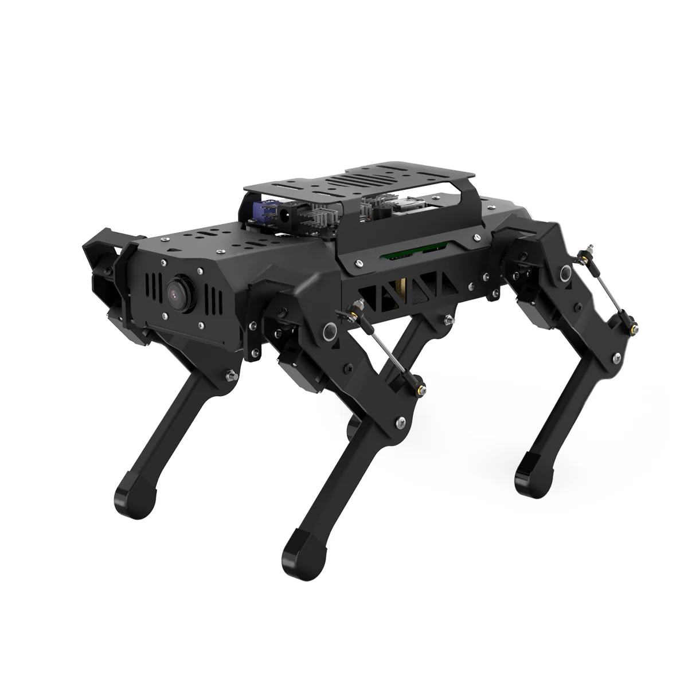

# PuppyPi

English | [中文](https://github.com/Hiwonder/PuppyPi/blob/ros2/README_cn.md)

<p align="center">
  
</p>

## Product Overview

PuppyPi is an AI quadruped robot dog developed based on Raspberry Pi 5. It features an aluminum alloy structure and is equipped with 8 high-performance coreless servos. The legs adopt a linkage structure design, enabling flexible and diverse movements that can easily achieve basic gaits such as free walking and climbing stairs. The robot's head is equipped with a high-definition wide-angle camera with first-person vision, enabling more interesting AI functions such as target tracking, face detection, visual patrol, and autonomous climbing.

PuppyPi has built-in ROS1 & ROS2 operating systems and supports Python programming, meeting users' needs for learning and verifying algorithms such as machine vision, robot kinematics, and quadruped gait control. PuppyPi also supports LiDAR and robotic arm expansion, enabling advanced creative applications such as SLAM mapping and navigation, dynamic obstacle avoidance, and autonomous grasping and transportation.

PuppyPi is deployed with multimodal AI large models. Combined with AI voice interaction box, it can understand the environment, plan actions and flexibly execute tasks, enabling more advanced embodied intelligence applications.

## Official Resources

### Official Hiwonder
- **Official Website**: [https://www.hiwonder.net/](https://www.hiwonder.net/)
- **Product Page**: [https://www.hiwonder.com/products/puppypi](https://www.hiwonder.com/products/puppypi)
- **Official Documentation**: [https://docs.hiwonder.com/projects/PuppyPi/en/latest/](https://docs.hiwonder.com/projects/PuppyPi/en/latest/)
- **Technical Support**: support@hiwonder.com

## Key Features

### AI Vision Functions
- **Target Tracking** - Real-time object tracking with AI algorithms
- **Face Detection** - Comprehensive face recognition capabilities
- **Color Recognition** - Advanced color detection and identification
- **Visual Patrol** - Intelligent visual surveillance and monitoring
- **AprilTag Detection** - Precision tag recognition for navigation
- **Autonomous Climbing** - AI-powered autonomous obstacle climbing

### Motion Control
- **Quadruped Gait Control** - Advanced four-legged locomotion algorithms
- **Free Walking** - Natural walking in multiple directions
- **Stair Climbing** - Autonomous stair ascent and descent
- **Posture Adjustment** - Dynamic balance and posture control
- **Performance Modes** - Pre-programmed action sequences
- **Remote Control** - Wireless control via APP and network

### Advanced Functions
- **SLAM Mapping** - Real-time simultaneous localization and mapping (with LiDAR)
- **Autonomous Navigation** - Path planning and autonomous navigation (with LiDAR)
- **Dynamic Obstacle Avoidance** - Real-time obstacle detection and avoidance (with LiDAR)
- **Robotic Arm Integration** - Grasping and manipulation capabilities (with arm expansion)
- **Voice Interaction** - Natural language voice commands
- **Multimodal AI Integration** - Advanced embodied intelligence

### Programming Interface
- **ROS1 & ROS2 Support** - Full Robot Operating System support
- **Python Programming** - Comprehensive Python SDK
- **Kinematics Library** - Complete inverse kinematics algorithms
- **Gait Library** - Customizable gait generation
- **Open Source** - Complete open-source platform for customization

## Hardware Configuration
- **Processor**: Raspberry Pi 5
- **Structure**: Aluminum alloy frame
- **Servos**: 8 high-performance coreless servos
- **Vision System**: High-definition wide-angle camera
- **Communication**: WiFi, Bluetooth
- **Expansion Support**: LiDAR, robotic arm
- **AI Integration**: Multimodal AI large models with voice interaction box

## Project Structure

```
puppypi/
├── apriltag_detect/         # AprilTag detection
├── color_detect/            # Color detection
├── face_detect/             # Face detection
├── object_tracking/         # Object tracking
├── visual_patrol/           # Visual patrol
├── puppy_bringup/          # System startup
├── puppy_control/          # Motion control
├── puppy_common/           # Common utilities
├── puppy_standard_functions/ # Standard AI functions
├── puppy_advanced_functions/ # Advanced functions
├── puppy_extend_demo/      # Extension demos
├── puppy_navigation/       # Navigation (LiDAR)
├── puppy_slam/            # SLAM mapping (LiDAR)
├── puppy_with_arm/        # Robotic arm integration
├── lidar_app/             # LiDAR applications
├── performance/           # Performance action sequences
├── interfaces/            # ROS message definitions
├── lab_config/           # Configuration files
├── large_models/         # AI large model integration
└── ros_robot_controller/ # Hardware controller
```

## Version Information
- **Current Version**: PuppyPi v1.0.0
- **Supported Platform**: Raspberry Pi 5
- **ROS Version**: ROS1 (Noetic)

### Related Technologies
- [ROS](http://www.ros.org/) - Robot Operating System
- [OpenCV](https://opencv.org/) - Computer Vision Library
- [Python](https://www.python.org/) - Programming Language

---

**Note**: This program is pre-installed on the PuppyPi robot system and can be run directly. For detailed tutorials, please refer to the [Official Documentation](https://docs.hiwonder.com/projects/PuppyPi/en/latest/).
