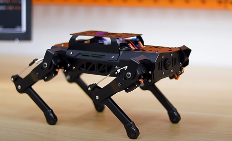

# PuppyPi

[English](https://github.com/Hiwonder/PuppyPi/blob/ros2/README.md) | 中文

<p align="center">
  
</p>

基于树莓派5的AI四足机器狗，支持ROS1&ROS2，集成计算机视觉、四足步态控制、SLAM导航、机械臂抓取等高阶AI功能。

## 产品介绍

PuppyPi是一款基于树莓派5开发的AI四足机器狗。它的机身采用铝合金结构，并搭载8个高性能空心杯舵机，腿部采用连杆结构设计，动作灵活丰富，可以轻松实现自由行走、上下台阶等基本步态。机器人的头部配备了高清广角摄像头，拥有第一视觉，能实现更多有趣的AI玩法，如目标追踪、人脸检测、视觉巡航、自主攀爬等。

PuppyPi内置ROS1&ROS2操作系统，支持Python编程，能满足用户对机器视觉、机器人运动学、四足步态控制等算法的学习和验证。PuppyPi还支持激光雷达和机械臂拓展，支持SLAM建图导航、动态避障、自主抓取搬运等高阶创意应用。

PuppyPi机身部署了多模态AI大模型，结合AI语音交互盒，它可以理解环境、规划行动并灵活执行任务，进而实现更多高阶具身智能应用。

## 官方资源

### Hiwonder官方
- **官方网站**: [https://www.hiwonder.net/](https://www.hiwonder.net/)
- **产品页面**: [https://www.hiwonder.com/products/puppypi](https://www.hiwonder.com/products/puppypi)
- **官方文档**: [https://docs.hiwonder.com/projects/PuppyPi/en/latest/](https://docs.hiwonder.com/projects/PuppyPi/en/latest/)
- **技术支持**: support@hiwonder.com

## 主要功能

### AI视觉功能
- **目标追踪** - 基于AI算法的实时目标追踪
- **人脸检测** - 全面的人脸识别能力
- **颜色识别** - 先进的颜色检测和识别
- **视觉巡航** - 智能视觉监控和巡视
- **AprilTag检测** - 精确的标签识别用于导航
- **自主攀爬** - AI驱动的自主障碍攀爬

### 运动控制
- **四足步态控制** - 先进的四足运动算法
- **自由行走** - 多方向自然行走
- **上下台阶** - 自主楼梯上下
- **姿态调整** - 动态平衡和姿态控制
- **表演模式** - 预编程动作序列
- **遥控功能** - 通过APP和网络的无线控制

### 高级功能
- **SLAM建图** - 实时同步定位与建图（需激光雷达）
- **自主导航** - 路径规划和自主导航（需激光雷达）
- **动态避障** - 实时障碍物检测与避障（需激光雷达）
- **机械臂集成** - 抓取和操作能力（需机械臂扩展）
- **语音交互** - 自然语言语音命令
- **多模态AI集成** - 先进的具身智能

### 编程接口
- **ROS1 & ROS2支持** - 完整的机器人操作系统支持
- **Python编程** - 全面的Python SDK
- **运动学库** - 完整的逆运动学算法
- **步态库** - 可定制的步态生成
- **开源平台** - 完整的开源平台支持定制化

## 硬件配置
- **处理器**: 树莓派5
- **结构**: 铝合金框架
- **舵机**: 8个高性能空心杯舵机
- **视觉系统**: 高清广角摄像头
- **通信**: WiFi、蓝牙
- **扩展支持**: 激光雷达、机械臂
- **AI集成**: 多模态AI大模型配AI语音交互盒

## 项目结构

```
puppypi/
├── src/                      # ROS2源码包
│   ├── puppy_bringup/        # 系统启动和配置
│   ├── puppy_control/        # 运动控制和运动学
│   ├── puppy_navigation/     # 导航和路径规划（激光雷达）
│   ├── puppy_slam/           # SLAM建图（激光雷达）
│   ├── puppy_with_arm/       # 机械臂集成
│   └── ros_robot_controller/ # 硬件控制器接口
├── example/                  # 示例应用和演示
├── interfaces/               # ROS2消息和服务定义
├── lab_config/              # 颜色识别配置
├── large_models/            # AI大模型集成
└── sources/                 # 资源和文档
```

## 版本信息
- **当前版本**: PuppyPi v1.0.0
- **支持平台**: 树莓派5
- **ROS版本**: ROS2 (Humble)

### 相关技术
- [ROS2](https://ros.org/) - 机器人操作系统2
- [OpenCV](https://opencv.org/) - 计算机视觉库
- [Python](https://www.python.org/) - 编程语言

---

**注**: 所有程序已预装在PuppyPi机器人系统中，可直接运行。详细使用教程请参考[官方文档](https://docs.hiwonder.com/projects/PuppyPi/en/latest/)。
